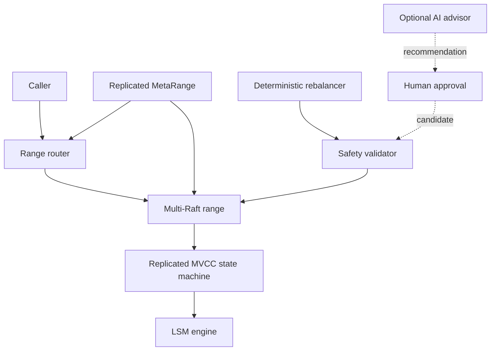

# RivetDB

**Experimental distributed transactional database built from first principles in Go.**

RivetDB combines a custom LSM-tree storage engine, Raft and Multi-Raft replication,
MVCC historical reads, Snapshot-Isolated distributed transactions with 2PC, online
range splitting, replica migration, workload-aware rebalancing, deterministic chaos
testing, and an optional validator-gated AI advisor.

> **Status:** feature-frozen, research-oriented engineering project. RivetDB is not
> production software and does not provide a network database service, authentication,
> backups, rolling upgrades, or a linearizable distributed read protocol.

## Why RivetDB?

The hard part of a distributed database is preserving the contracts between storage,
consensus, transactions, sharding, membership changes, automatic control, and crash
recovery. RivetDB implements those layers together so their failure boundaries can be
specified and tested rather than hidden behind external systems. It explores engineering
depth; it does not claim novelty over production databases.

## Architecture



The caller-facing APIs are in-process; the diagram does not imply a network server.
The advisor has no execution path. See the [complete diagram set](docs/diagrams.md)
and [architecture](docs/architecture.md).

## Key systems

### Storage engine

The local engine implements a checksummed WAL, concurrent skip-list MemTables,
immutable SSTables with Bloom filters, crash-safe manifests, bounded table caching,
flush, recovery, and version-preserving compaction. Its byte format and fsync ordering
are specified in [storage-engine.md](docs/storage-engine.md).

### Consensus and Multi-Raft

Each key range has an independent Raft group with durable term, vote, log, snapshots,
quorum commit, and ordered apply. A node hosts multiple groups behind a durable range
catalog, bounded transport, and schedulers. See [raft.md](docs/raft.md) and
[multiraft.md](docs/multiraft.md).

### MVCC and transactions

Replicated HLC timestamps retain historical values across flush, compaction, restart,
and convergence. Cross-range transactions use one read timestamp, replicated intents
and transaction records, first-committer-wins checks, and epoch-fenced 2PC. The
certified isolation level is **Snapshot Isolation**, which permits write skew; it is
not serializable. See [mvcc.md](docs/mvcc.md) and [transactions.md](docs/transactions.md).

### Online sharding and replica migration

Range splitting builds shadow children from a logical MVCC image, replays concurrent
deltas, fences briefly, and atomically changes routing through the MetaRange. Migration
bootstraps a learner, catches it up, uses joint consensus, transfers leadership when
needed, and retires the old replica. See [range-splitting.md](docs/range-splitting.md)
and [replica-migration.md](docs/replica-migration.md).

### Automatic rebalancing

Injected-clock telemetry feeds immutable planning snapshots. The deterministic
controller applies health, placement, capacity, cooldown, and operation-exclusion
constraints before proposing moves, splits, or leadership transfers. See
[rebalancing.md](docs/rebalancing.md).

### Optional AI advisor

The provider-neutral advisor consumes bounded canonical telemetry and produces strict,
evidence-grounded recommendations. It cannot choose targets or split keys, mutate
metadata, execute actions, or participate in recovery; human approval still invokes
the deterministic planner and fresh validator. Certification is offline and requires
no live provider. See [ai-operator.md](docs/ai-operator.md).

## Correctness evidence

| Area | Evidence |
|---|---|
| Storage durability | Checksummed formats, publication failure injection, and every-offset WAL/SSTable/manifest crash campaigns |
| Consensus | Seeded 3/5-node partitions, duplicate/reordered messages, snapshots, and joint-consensus counterexamples |
| MVCC and transactions | Historical reference digests, atomic commit timestamps, conflict models, restarts, and cross-range crash matrices |
| Split and migration | Failure at each protocol stage, stale routing, learner catch-up, cutover, and old-ReplicaID non-resurrection |
| Whole system | Deterministic one-million-event model and a real-filesystem five-node crash/recovery campaign |
| Concurrency | Race-detector gates, bounded goroutine/channel checks, and injected clocks |
| Advisor | Schema fuzzing, stale/invented-ID rejection, disabled equivalence, and shadow chaos |

Claims and exclusions are defined in [correctness.md](docs/correctness.md), with
stable properties in [invariants.md](docs/invariants.md). Selected tests are linked
from the [documentation index](docs/README.md#tests-worth-reading).

## Selected performance evidence

These are five-sample medians from an Apple M4 MacBook Air, 10 cores, 16 GiB,
macOS 15.7.4, Go 1.25.14. Ranges and allocations are in the
[machine-readable dataset](docs/evidence/phase-11-benchmarks.csv).

**Exact-host CPU microbenchmarks**

| Operation | Scale | Median |
|---|---:|---:|
| Active-MemTable `Get` | one lookup | 150.8 ns |
| Historical `GetAt` | 1,000 versions/key | 354.2 ns |
| `ScanAt` | 1,000 keys | 138.7 µs |
| Catalog lookup | 1,000 ranges | 69.37 ns |
| Rebalance plan | 1,000 ranges | 711.8 µs |

**In-process or constrained baselines**

| Operation | Median | Classification |
|---|---:|---|
| Three-node Raft propose/commit/apply | 55.10 µs | in-process simulator |
| Two-participant transaction | 288.4 ms | constrained, in-process, durable |
| Empty-image range split | 954.1 ms | constrained, in-process |
| 156-byte replica migration | 807.2 ms | constrained, in-process |

Disk-sensitive measurements were taken on a nearly full APFS development volume and
are constrained engineering baselines, not representative production-storage results.
Distributed benchmarks are in-process unless noted; no real-network or multi-host
performance claim is made. See [performance.md](docs/performance.md) and
[the full evidence](docs/evidence/phase-11.md).

## Quick start

RivetDB requires Go 1.25 or later and has no third-party module dependencies.

```bash
go test ./...
make check             # format, vet, lint, tidy, normal tests, diff checks
make race              # race detector, two runs
make certify-local     # complete local-storage gate
make certify-raft      # Raft plus inherited local gate
make certify-chaos     # long: compositional and inherited gates
make certify-advisor   # long: final offline gate
```

`make check` requires golangci-lint v2.6.1. Heavy certification is intentionally
not part of the quick start; `make help` lists every tier.

## Reproducible demos

These commands execute real implementation paths, not a separate demo engine.

```bash
# Cross-range 2PC with one commit timestamp.
go test -v -run '^TestTwoAndThreeRangeTransactionsUseOneCommitTimestamp$' ./internal/multiraft

# Online writes, transaction fencing, child activation, and stale-route refresh.
go test -v -run 'TestSplitKeepsOrdinaryWritesOnlineAndFencesTransactions|TestStaleRouterRefreshesFromCommittedMetadataRedirect' ./internal/multiraft

# Learner catch-up, joint consensus, cutover, and source retirement.
go test -v -run 'TestOnlineFollowerMigrationPreservesStateAndRetiresSource|TestElectionAndCommitInJointConfiguration' ./internal/multiraft

# Advisor approval plus hallucinated/stale recommendation rejection.
go test -v -run 'TestAnalyzeApproveAndAuditLink|TestStaleHallucinatedCooldownAndOperationAdviceRejected' ./internal/advisor
```

## Repository map

| Path | Responsibility |
|---|---|
| `internal/storage` | LSM formats, WAL, MemTables, SSTables, manifest, engine, compaction |
| `internal/raft` | Raft state machine, persistence, membership, snapshots, simulator |
| `internal/replicatedrange` | Raft-indexed MVCC application and range lifecycle |
| `internal/multiraft` | Catalog, routing, transactions, split, migration, rebalancing |
| `internal/mvcc`, `internal/txn` | Timestamp and transaction protocol types/codecs |
| `internal/chaos` | Compositional reference model and replayable fault schedules |
| `internal/advisor` | Optional read-only advisory boundary |

## Limitations

- No general network server/client or real multi-host benchmark.
- No linearizable distributed read protocol or `ReadIndex` path.
- Snapshot Isolation only; no serializable isolation or SSI.
- No MVCC/tombstone/transaction-record garbage collection.
- No range merge, SQL, authentication, encryption, backup, or upgrade protocol.
- Crash-stop recovery is modeled; Byzantine faults are out of scope.

RivetDB is an experimental systems project, not production software. Start with the
[documentation index](docs/README.md), review the [roadmap](docs/roadmap.md), and
read [CONTRIBUTING.md](CONTRIBUTING.md) before changing certified behavior.

Licensed under [Apache License 2.0](LICENSE).
