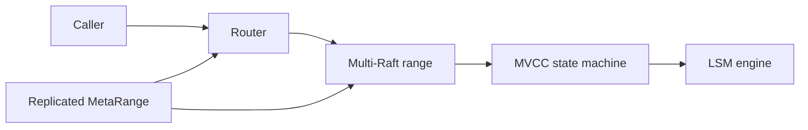
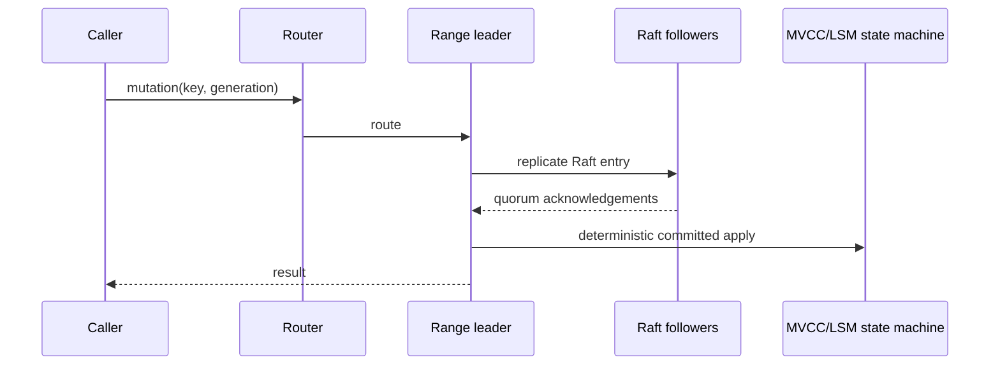
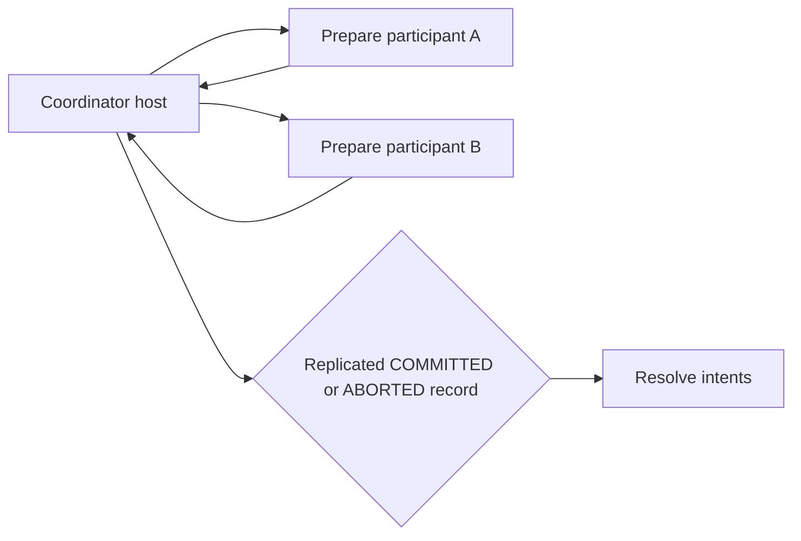
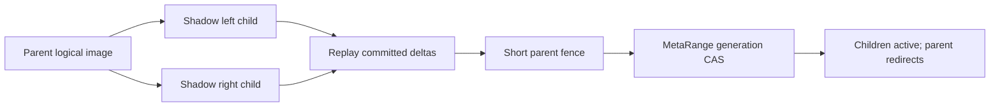
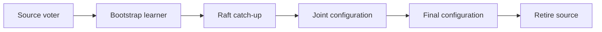
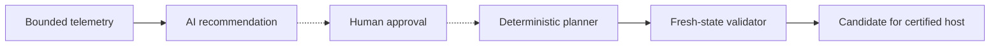

# Architecture diagrams

These diagrams show implemented in-process boundaries. Dashed arrows are advisory.

## System overview

## Write path

## Distributed transaction

The replicated transaction record, not coordinator memory, is recovery authority.

## Online range split

## Replica migration

## Safe AI boundary

There is no AI-to-Raft, AI-to-MetaRange, or advisor execution edge.
